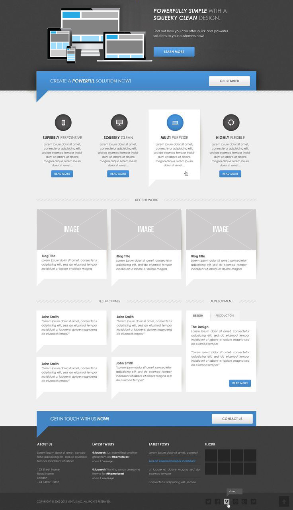

# Assignment 2

The purpose of this assignment is to practise HTML and CSS by copying an image and make the website to look as similar to it as possible.

## Demo

[Assignment 2](http://htmlpreview.github.io/?https://github.com/johannarousi/Assignment2/blob/master/index.html)

## Technologies

- HTML
- CSS

## Licence

MIT

## Author

Johanna Rousi

## Image

